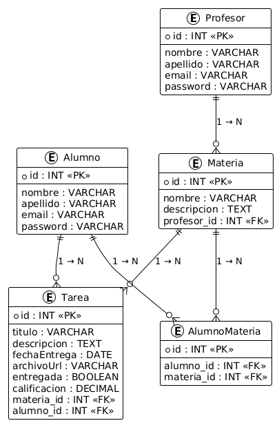
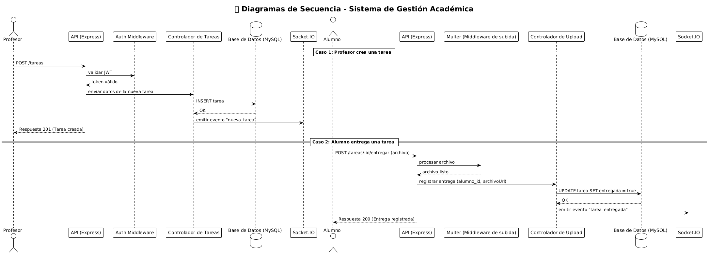

# 🏫 Proyecto Final - Backend (Gestión Académica)

Integrantes: Franco Seguel, Yair Melinguer

Este es el backend para una plataforma de **gestión académica** que permite a **Profesores y Alumnos** administrar materias, tareas y entregas. El proyecto está construido con **Node.js**, **Express**, **TypeORM** y utiliza **autenticación JWT** con **Passport** para la seguridad.

---

## Características Principales

- 👥 **Gestión de Usuarios**: Registro y autenticación (Login) para Profesores y Alumnos.  
- 🔐 **Autenticación JWT + Passport**: Rutas privadas protegidas.  
- 📚 **Gestión Académica (CRUDs)**:
  - Materias  
  - Tareas  
  - Matrículas (relación Alumno ↔ Materia)
- ✅ **Validación de Datos**: DTOs con **Joi**.  
- 📎 **Subida de Archivos**: Entregas de tareas con **Multer**.  
- 🔔 **Notificaciones en Tiempo Real** con **Socket.IO**:
  - Al crear una nueva tarea.  
  - Al entregar una tarea.  
- ⚙️ **Configuración Segura**: Variables de entorno validadas con **Joi** y **dotenv**.

---

## 🛠️ Tecnologías Utilizadas

## Dependencias instaladas
npm install express typeorm mysql2 passport passport-jwt jsonwebtoken dotenv joi reflect-metadata nodemon cors

| Tecnología | Descripción |
|-------------|--------------|
| **Node.js** | Entorno de ejecución para JavaScript en el servidor. |
| **Express.js** | Framework minimalista para crear el servidor y manejar rutas. |
| **TypeORM** | ORM que facilita el manejo de entidades y relaciones con MySQL. |
| **MySQL** | Sistema de gestión de bases de datos relacional. |
| **Passport.js** | Middleware para autenticación con JWT. |
| **jsonwebtoken (JWT)** | Manejo seguro de sesiones con tokens. |
| **bcrypt** | Encriptación de contraseñas. |
| **Joi** | Validación de variables de entorno y DTOs. |
| **dotenv** | Carga de variables de entorno desde `.env`. |
| **Multer** | Middleware para subida de archivos (entregas de tareas). |
| **Socket.IO** | Comunicación en tiempo real entre cliente y servidor. |
| **Nodemon** | Reinicio automático del servidor en desarrollo. |

---

## Endpoints del Proyecto Final - Backend (Gestión Académica) 

Autenticación (/api/auth)

| Método   | Ruta              | Descripción                                              | Acceso  |
| :------- | :---------------- | :------------------------------------------------------- | :------ |
| **POST** | `/api/auth/login` | Inicia sesión como profesor o alumno (retorna token JWT) | Público |

Body:
ej:

{
  "email": "correo@ejemplo.com",
  "password": "123456"
}

Respuesta EXitosa (200)
{
  "ok": true,
  "user": {
    "id": 1,
    "nombre": "Carlos",
    "apellido": "López",
    "email": "carlos.lopez@example.com",
    "role": "profesor"
  },
  "token": "JWT_TOKEN_GENERADO"
}

## Profesores (/api/profesores)

| Método     | Ruta                  | Descripción                                                        | Acceso  |
| :--------- | :-------------------- | :----------------------------------------------------------------- | :------ |
| **POST**   | `/api/profesores`     | Crea un nuevo profesor (password se encripta)                      | Público |
| **GET**    | `/api/profesores`     | Obtiene todos los profesores (sin contraseñas)                     | Privado |
| **GET**    | `/api/profesores/:id` | Obtiene un profesor por su ID                                      | Privado |
| **PUT**    | `/api/profesores/:id` | Actualiza datos del profesor (si envía contraseña, se re-encripta) | Privado |
| **DELETE** | `/api/profesores/:id` | Elimina un profesor                                                | Privado |

Ejemplo Body (POST):

{
  "nombre": "Carlos",
  "apellido": "López",
  "email": "carlos.lopez@example.com",
  "password": "123456",
  "rol": "profesor"
}

## Alumnos (/api/alumnos)

| Método     | Ruta               | Descripción                                 | Acceso  |
| :--------- | :----------------- | :------------------------------------------ | :------ |
| **POST**   | `/api/alumnos`     | Crea un nuevo alumno (password se encripta) | Público |
| **GET**    | `/api/alumnos`     | Obtiene todos los alumnos (sin contraseñas) | Privado |
| **GET**    | `/api/alumnos/:id` | Obtiene un alumno por su ID                 | Privado |
| **PUT**    | `/api/alumnos/:id` | Actualiza datos de un alumno                | Privado |
| **DELETE** | `/api/alumnos/:id` | Elimina un alumno                           | Privado |

Ejemplo Body (POST):

{
  "nombre": "María",
  "apellido": "Fernández",
  "email": "maria.fernandez@example.com",
  "password": "123456",
  "rol": "alumno"
}

## Materias (/api/materias)

| Método     | Ruta                | Descripción                                      | Acceso  |
| :--------- | :------------------ | :----------------------------------------------- | :------ |
| **POST**   | `/api/materias`     | Crea una nueva materia y la asocia a un profesor | Privado |
| **GET**    | `/api/materias`     | Lista todas las materias                         | Privado |
| **GET**    | `/api/materias/:id` | Obtiene una materia por su ID                    | Privado |
| **PUT**    | `/api/materias/:id` | Actualiza datos de una materia                   | Privado |
| **DELETE** | `/api/materias/:id` | Elimina una materia                              | Privado |

Ejemplo Body (POST):

{
  "nombre": "Programación Backend",
  "descripcion": "Introducción a Node.js y Express",
  "profesor_id": 1
}

## Tareas (/api/tareas)

| Método     | Ruta                       | Descripción                                                              | Acceso  |
| :--------- | :------------------------- | :----------------------------------------------------------------------- | :------ |
| **POST**   | `/api/tareas`              | Crea una nueva tarea asociada a una materia (emite evento `nueva_tarea`) | Privado |
| **GET**    | `/api/tareas`              | Lista todas las tareas                                                   | Privado |
| **GET**    | `/api/tareas/:id`          | Obtiene una tarea específica por ID                                      | Privado |
| **PUT**    | `/api/tareas/:id`          | Actualiza datos de una tarea                                             | Privado |
| **DELETE** | `/api/tareas/:id`          | Elimina una tarea                                                        | Privado |
| **PUT**    | `/api/tareas/:id/entregar` | Marca la tarea como entregada y emite `tarea_entregada`                  | Privado |

Ejemplo Body (crear tarea):
{
  "titulo": "Trabajo Práctico 1",
  "descripcion": "Desarrollar un API REST con Express",
  "fechaEntrega": "2025-11-05",
  "materia_id": 2
}

Ejemplo Body (entregar tarea):
{
  "alumno_id": 1
}

## Matrículas (/api/matriculas)

| Método     | Ruta                          | Descripción                                                              | Acceso   |
| :--------- | :---------------------------- | :----------------------------------------------------------------------- | :------- |
| **POST**   | `/api/matriculas`             | Matricula (inscribe) un alumno en una materia.                           | Profesor |
| **GET**    | `/api/matriculas`             | Lista todas las relaciones de matrícula existentes (alumnos ↔ materias). | Privado  |
| **GET**    | `/api/matriculas/materia/:id` | Obtiene todos los alumnos matriculados en una materia específica.        | Privado  |
| **GET**    | `/api/matriculas/alumno/:id`  | Obtiene todas las materias en las que está matriculado un alumno.        | Privado  |
| **DELETE** | `/api/matriculas/:id`         | Elimina una matrícula (quita un alumno de una materia).                  | Profesor |

{
  "alumnoId": 1,
  "materiaId": 2
}

{
  "message": "Alumno matriculado correctamente ✅",
  "data": {
    "id": 1,
    "alumno": {
      "id": 1,
      "nombre": "Lucas",
      "apellido": "Ramirez"
    },
    "materia": {
      "id": 2,
      "nombre": "Backend"
    }
  }
}

## Subida de Archivos (/api/upload)

| Método   | Ruta          | Descripción                                           |
| :------- | :------------ | :---------------------------------------------------- |
| **POST** | `/api/upload` | Sube un archivo (entrega de tarea) usando `form-data` | 

Body (form-data):

archivo: (file)
alumno_id: 1
tarea_id: 3

Respuesta Exitosa (200):
{
  "message": "Archivo subido correctamente",
  "archivoUrl": "uploads/1730123456789-tarea1.pdf",
  "entregada": true
}

## Matrícula (Alumno-Materia)

Ruta base: /api/matriculas

1. POST /api/matriculas (Rol: Profesor)

Acción: Matricula (inscribe) un alumno en una materia.
Body (JSON):

{
  "alumnoId": 1,
  "materiaId": 2
}

2. GET /api/matriculas (Privada)

Acción: Lista todas las relaciones de matrícula existentes (alumnos ↔ materias).
Disponible para: Profesor o Alumno autenticado.

3. GET /api/matriculas/materia/:id (Privada)

Acción: Obtiene todos los alumnos matriculados en una materia específica (por su ID).
Ejemplo:
GET /api/matriculas/materia/2

4. GET /api/matriculas/alumno/:id (Privada)

Acción: Obtiene todas las materias en las que está matriculado un alumno (por su ID).
Ejemplo:
GET /api/matriculas/alumno/1

5. DELETE /api/matriculas/:id (Rol: Profesor)

Acción: Elimina una matrícula (quita un alumno de una materia).
Ejemplo:
DELETE /api/matriculas/3

## Eventos en Tiempo Real (Socket.IO) 

| Evento            | Disparado por | Descripción                        | Payload                                                                        |
| :---------------- | :------------ | :--------------------------------- | :----------------------------------------------------------------------------- |
| `nueva_tarea`     | Servidor      | Cuando un profesor crea una tarea  | `{ message: "Nueva tarea creada: [Titulo]", data: {...} }`                     |
| `tarea_entregada` | Servidor      | Cuando un alumno entrega una tarea | `{ message: "El alumno con ID [ID] entregó la tarea: [Titulo]", data: {...} }` |

## Ruta Base del Servidor.

| Método  | Ruta | Descripción                                            |
| :------ | :--- | :----------------------------------------------------- |
| **GET** | `/`  | Verifica que el servidor esté corriendo correctamente. |

## 🧱 6. Modelo Entidad–Relación (MER)

El **Modelo Entidad–Relación (MER)** representa la estructura lógica de la base de datos del sistema.  
Muestra las entidades principales (**Profesores**, **Alumnos**, **Materias**, **Tareas** y **Alumno_Materia**) y cómo se relacionan entre sí.

---

### 🔹 Entidades y Relaciones

#### 👨‍🏫 Profesor
- **Atributos:** id (PK), nombre, apellido, email, password  
- **Relación:** Un profesor tiene muchas materias *(1 → N)*

#### 👨‍🎓 Alumno
- **Atributos:** id (PK), nombre, apellido, email, password  
- **Relaciones:**
  - Un alumno puede estar en muchas materias *(N ↔ M, a través de AlumnoMateria)*  
  - Un alumno puede entregar muchas tareas *(1 → N)*

#### 📘 Materia
- **Atributos:** id (PK), nombre, descripcion, profesor_id (FK)  
- **Relaciones:**
  - Una materia pertenece a un profesor *(N → 1)*  
  - Una materia tiene muchas tareas *(1 → N)*  
  - Una materia tiene muchos alumnos *(N ↔ M)*

#### 🧾 Tarea
- **Atributos:** id (PK), titulo, descripcion, fechaEntrega, archivoUrl, entregada, calificacion, materia_id (FK), alumno_id (FK)  
- **Relaciones:**
  - Una tarea pertenece a una materia *(N → 1)*  
  - Una tarea pertenece a un alumno *(N → 1)*

#### 🔗 AlumnoMateria (Tabla Intermedia)
- **Atributos:** id (PK), alumno_id (FK), materia_id (FK)  
- **Función:** Relaciona **Alumnos** con **Materias** (N ↔ M)
Atributos:

id (PK) → Identificador único de la matrícula

alumno_id (FK → alumnos.id) → Referencia al alumno matriculado

materia_id (FK → materias.id) → Referencia a la materia en la que se inscribe

Función:
Relaciona la entidad Alumno con la entidad Materia para representar la relación N ↔ M, permitiendo que:

Un alumno pueda estar matriculado en múltiples materias.

Una materia pueda tener múltiples alumnos.

### 📘 Relaciones del MER

| Relación | Tipo | Descripción |
|-----------|------|--------------|
| Profesor → Materia | 1 → N | Un profesor dicta varias materias |
| Materia → Tarea | 1 → N | Una materia puede tener varias tareas |
| Alumno → Tarea | 1 → N | Un alumno puede entregar varias tareas |
| Alumno ↔ Materia | N ↔ M | Relación mediante `AlumnoMateria` |

---

### 🧩 Diagrama MER (en texto)

PROFESOR (1) ───────< MATERIA (N)
MATERIA (1) ───────< TAREA (N)
ALUMNO  (1) ───────< TAREA (N)
ALUMNO  (N) ───────< ALUMNO_MATERIA (M) >────── (N) MATERIA

## 🎬 7. Diagramas de Secuencia

Los **diagramas de secuencia** representan cómo interactúan los diferentes actores y componentes del sistema a lo largo del tiempo.  
Muestran el **orden de los mensajes** entre usuarios, controladores, base de datos y servicios del backend.

A continuación se presentan los dos flujos más importantes del sistema:

###  Caso 1: Profesor crea una tarea

**Descripción:**  
El profesor, una vez autenticado, crea una nueva tarea desde la interfaz.  
El backend valida los datos, la almacena en la base de datos y notifica a los alumnos en tiempo real mediante **Socket.IO**.

**Participantes:**
- Profesor (Actor)
- API (Express)
- Auth Middleware (valida JWT)
- Controlador de Tareas
- Base de Datos (MySQL)
- Socket.IO (Servidor de eventos)

**Flujo:**

Profesor         API (Express)       Auth Middleware     Controlador       Base de Datos       Socket.IO
   |                    |                    |                  |                  |                  |
   |---- POST /tareas -->|                    |                  |                  |                  |
   |                     |---- validar JWT -->|                  |                  |                  |
   |                     |<--- token válido --|                  |                  |                  |
   |                     |---- enviar datos -------------------->|                  |                  |
   |                     |                                       |---- INSERT ----->|                  |
   |                     |                                       |<---- OK ---------|                  |
   |                     |---- emitir evento "nueva_tarea" ----------------------------------------->|
   |<----------- Respuesta 201 (Tarea creada) -------------------------------------------------------|

## Caso 2: Alumno entrega una tarea

Descripción:
El alumno selecciona una tarea y envía su entrega (archivo PDF o documento).
El backend usa Multer para gestionar el archivo, actualiza la base de datos y emite una notificación en tiempo real.

Participantes:

Alumno (Actor)

API (Express)

Multer (Middleware de subida)

Controlador de Upload

Base de Datos (MySQL)

Socket.IO

## Flujo
Flujo:

Profesor API (Express) Auth Middleware Controlador Base de Datos Socket.IO | | | | | | |---- POST /tareas -->| | | | | | |---- validar JWT -->| | | | | |<--- token válido --| | | | | |---- enviar datos -------------------->| | | | | |---- INSERT ----->| | | | |<---- OK ---------| | | |---- emitir evento "nueva_tarea" ----------------------------------------->| |<----------- Respuesta 201 (Tarea creada) -------------------------------------------------------|

## Secuencia completo 

## Diagrama de Clases

+----------------+
|    Profesor    |
+----------------+
| - id           |
| - nombre       |
| - apellido     |
| - email        |
| - password     |
| - rol="profesor"|
+----------------+
|                |
+----------------+
          |
          | 1..* 
          |
          v
+----------------+
|     Tarea      |
+----------------+
| - id           |
| - titulo       |
| - descripcion  |
| - fechaEntrega |
| - archivoUrl   |
| - entregada    |
| - profesor_id  |
| - alumno_id    |
| - materia_id   |
+----------------+
          ^
          | 1..*
          |
+----------------+
|     Alumno     |
+----------------+
| - id           |
| - nombre       |
| - apellido     |
| - email        |
| - password     |
| - rol="alumno" |
+----------------+
          |
          | *..* (matriculas)
          |
          v
+----------------+
| AlumnoMateria  |
+----------------+
| - id           |
| - alumno_id    |
| - materia_id   |
+----------------+
          ^
          | 1..*
          |
+----------------+
|    Materia     |
+----------------+
| - id           |
| - nombre       |
| - descripcion  |
+----------------+

Relaciones
Profesor 1..* → Tarea

Alumno 1..* → Tarea

Materia 1..* → Tarea

Alumno .. Materia (a través de AlumnoMateria)

- Diagrama de Casos de Uso

  +------------------+
        |    Profesor      |
        +------------------+
        |                  |
        | - Crear Tarea    |
        | - Actualizar Tarea|
        | - Eliminar Tarea |
        | - Asignar Alumnos|
        +------------------+
                  |
                  | <<notifica>> nueva_tarea
                  v
              Alumno
        +------------------+
        |      Alumno      |
        +------------------+
        | - Ver Tareas     |
        | - Entregar Tarea |
        | - Ver Materias   |
        +------------------+
                  |
                  | <<notifica>> tarea_entregada
                  v
              Profesor

relaciones de los eventos

nueva_tarea → todos los alumnos matriculados en la materia reciben notificación.

tarea_entregada → profesor recibe notificación.

## 🧩 1. Instalación

Clonar el repositorio:

git clone https://github.com/Francoseguel34/Proyecto-final-backend.git
cd Proyecto-final-backend
